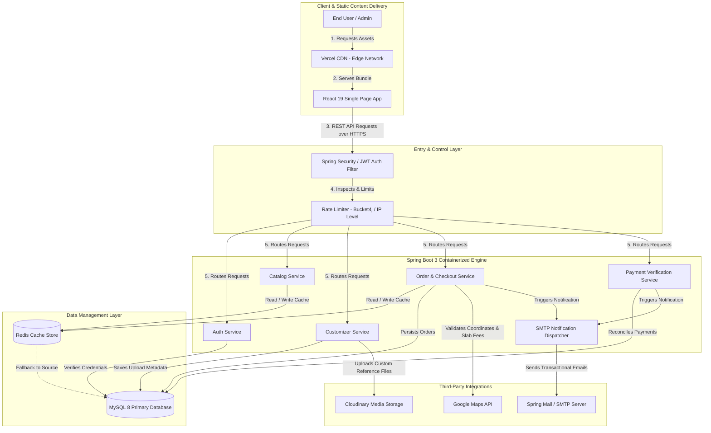
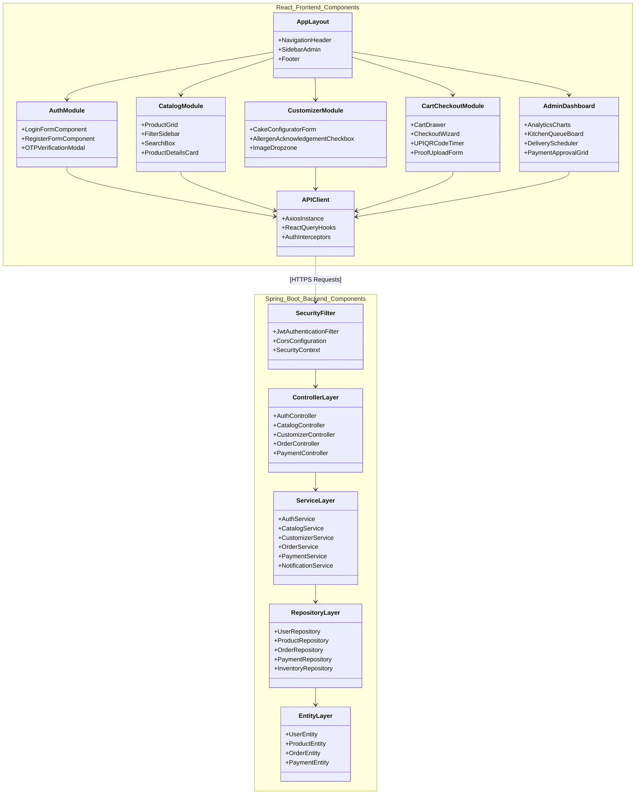
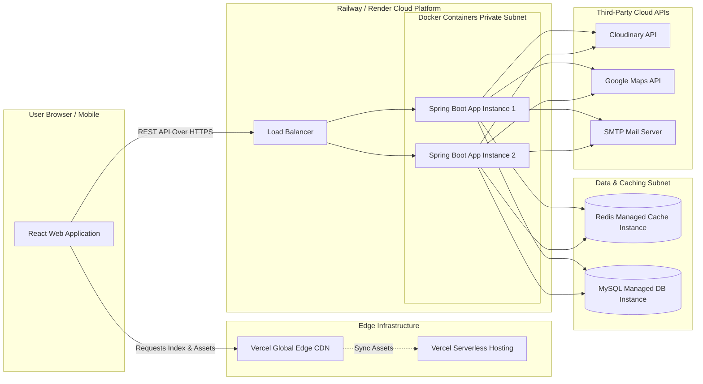

# Payal's Bakery Cottage - System Architecture Blueprint
**Document Version:** 1.0.0  
**Author:** Antigravity (Lead Architect)  
**Status:** In Progress (Section 1 Completed)

---

## 1. Overall System Architecture

### 1.1 Architecture Overview
The architecture of **Payal's Bakery Cottage** is designed to support a high-volume, secure, and production-grade bakery e-commerce experience. To achieve maximum maintainability, separation of concerns, and ease of scalability, the system implements a hybrid architectural style: **Layered Architecture** combined with **Feature-Based Modular Architecture**.

```
+-----------------------------------------------------------------------+
|                             Presentation Layer                        |
|   React 19, Vite, Tailwind CSS, shadcn/ui, Framer Motion, Axios,     |
|   React Query, React Hook Form, Zod                                   |
+-----------------------------------------------------------------------+
                                    |  (REST over HTTPS / JSON)
                                    v
+-----------------------------------------------------------------------+
|                           Backend Application                         |
|   Java 21, Spring Boot 3, Spring Security (RBAC, JWT), Spring Data    |
|   JPA, Hibernate, MapStruct, Lombok                                   |
+-----------------------------------------------------------------------+
       | (Cache Read/Write)                        | (Relational DB)
       v                                           v
+-----------------------------+             +---------------------------+
|         Cache Layer         |             |      Database Layer       |
|       Redis Cache Server     |             |      MySQL 8 Database     |
+-----------------------------+             +---------------------------+
```

#### Key Design Pillars:
1. **Separation of Concerns:** Distinct layers handle specific aspects of the application. The user interface does not know about the database structure, and the database does not know about the presentation.
2. **Feature-Based Modularization:** Both frontend and backend codebases are grouped by business domains (e.g., `auth`, `catalog`, `customizer`, `order`, `payment`, `admin`). This isolates changes, speeds up developer onboarding, and makes the system ready for a future microservices transition.
3. **Stateless Backend:** Authentication is stateless, managed using JSON Web Tokens (JWT). The application server stores no session state, enabling seamless horizontal scaling behind a load balancer.
4. **Performance & Caching:** Redis is utilized to cache database-intensive reads (such as product categories, catalog filters, and active coupons). Static assets and dynamic user images are offloaded to Cloudinary and Vercel CDN.

---

### 1.2 High-Level System Architecture Diagram
The high-level architecture diagram illustrates the end-to-end integration from client web requests down to third-party services and state management stores.



---

### 1.3 Component Diagram
The component diagram outlines the internal structural components of both the Frontend and Backend applications, detailing the structural contracts and API communication.



---

### 1.4 Request Flow
Every client interaction is executed through a strict request-response lifecycle designed to enforce security, validation, database performance, and clean formatting.

#### Detailed Flow Sequence (e.g., Submitting a Custom Cake Order):
```
Client Browser                  Gateway / Security                  Controller                  Service                  Repository / DB
     |                                  |                               |                          |                            |
     |--- 1. POST /api/orders/custom -->|                               |                          |                            |
     |    (JSON Payload & Auth JWT)     |                               |                          |                            |
     |                                  |--- 2. Filter & Authenticate ->|                          |                            |
     |                                  |    (Validates Token & Roles)  |                          |                            |
     |                                  |                               |--- 3. Validate DTO ----->|                            |
     |                                  |                               |   (JSR-380, Zod check)   |                            |
     |                                  |                               |                          |--- 4. Start Transaction -->|
     |                                  |                               |                          |    (Check preparation gate)|
     |                                  |                               |                          |--- 5. Verify Inventory --->|
     |                                  |                               |                          |                            |--- 6. Save Entity ->|
     |                                  |                               |                          |                            |    (Optimistic Lock)|
     |                                  |                               |                          |<-- 7. Persist Success -----|                     |
     |                                  |                               |                          |--- 8. Dispatch Email ----->| (Async SMTP)        |
     |                                  |                               |<-- 9. Map Entity to DTO -|                                                  |
     |                                  |<-- 10. Return Response HTTP 201--------------------------|                                                  |
     |<-- 11. Render Order Confirmation |                               |                          |                            |
```

1. **Client Submission:** The frontend collects custom cake choices, triggers client-side validation using Zod and React Hook Form, and uploads reference photos to Cloudinary. It then dispatches a POST request to `/api/orders/custom` with the JSON metadata and bearer JWT.
2. **Security Gateway:** The Spring Security Filter Chain intercepts the request:
   - Validates the JWT signature and expiration.
   - Extracts roles (e.g., `ROLE_CUSTOMER`) and assigns permissions.
   - Checks rate-limiting parameters (e.g., bucket capacity) to prevent DoS attacks.
3. **Controller Validation:** The `OrderController` receives the payload, deserializes it to an `OrderCreateDTO`, and invokes `@Valid` annotations to trigger Spring bean validations (e.g., `@NotNull`, `@FutureOrPresent`).
4. **Service Business Logic:** The `OrderService` starts a transaction (`@Transactional`):
   - Computes dynamic pricing based on customization.
   - Checks the business hours, holiday calendars, and the next-day processing gate.
   - Validates that the selected delivery date meets the product's preparation lead time.
   - Checks inventory stock availability for base ingredients.
5. **Database Transaction:** The `OrderRepository` issues standard query operations to the MySQL instance via Hibernate. It applies optimistic locking to prevent double-booking of delivery slots.
6. **Async Notifications:** Upon transaction commit, the `NotificationService` asynchronously formats an HTML email from an SMTP template and sends the invoice summary to the customer.
7. **Response Mapping:** The service returns the persisted entity, which the `MapStruct` mapper transforms into an `OrderResponseDTO` (removing internal passwords or system IDs), and returns an HTTP 201 Created response to the client.

---

### 1.5 Deployment Architecture
The platform is deployed using modern cloud resources to ensure scalability, reliability, and low latency.



#### Infrastructure Specifications:
* **Frontend Hosting (Vercel):** Hosts the static single-page application built via Vite. Features edge routing, custom headers, and Gzip/Brotli file compression.
* **Backend Hosting (Railway / Render):** Deploys a Docker container containing the Java 21 JRE and Spring Boot executable jar. Automates horizontal scale triggers based on CPU/Memory thresholds (e.g., auto-spin up of Instance 2 if CPU usage exceeds 70%).
* **Database Hosting (Railway / Render Managed MySQL):** Fully managed MySQL 8 database instance with automatic connection pooling (HikariCP), daily automated backups, and database security groups restricting connections exclusively to Railway private network IPs.
* **Caching (Railway / Render Managed Redis):** Private Redis instance utilized for high-throughput string and hash caches, featuring single-digit millisecond latency.
* **Storage (Cloudinary):** Cloud-native asset storage. The application uploads images securely from the client side using signed URLs generated by the backend, decoupling file processing from application servers.
