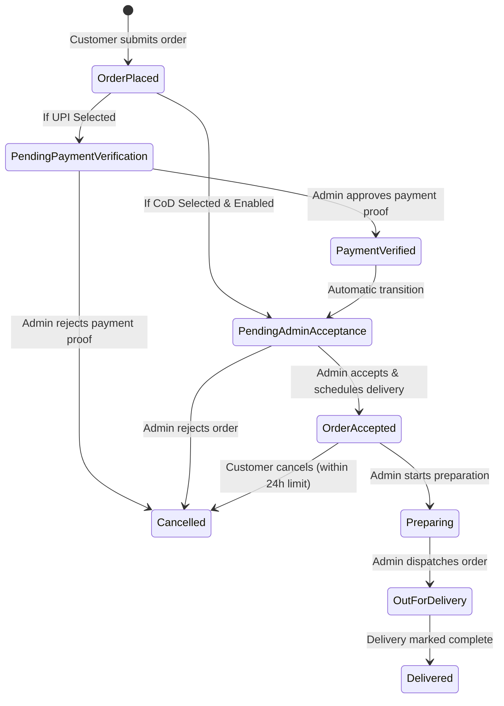
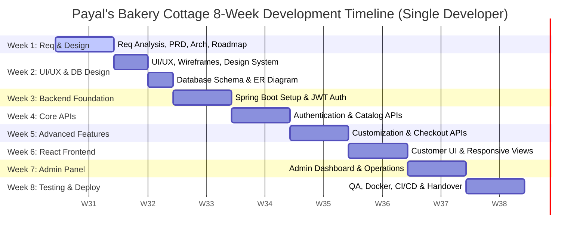
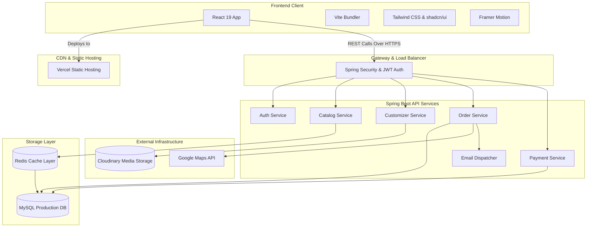

# Product Requirements Document (PRD)
## Project: Payal's Bakery Cottage
**Document Version:** 1.0.0  
**Author:** Kshitij The Developer  
**Date:** August 5, 2026  
**Status:** Under Review  

---

## 1. Executive Summary
Payal's Bakery Cottage is a premium, modern homemade bakery that delivers high-quality, fresh-baked goods and customized artisanal cakes directly to customers. The goal of this project is to design and develop a production-ready, fully responsive e-commerce web application. 

The application will bridge the gap between traditional baking craftsmanship and modern digital convenience. Customers can browse standard products, interactively configure custom cakes, place scheduled orders, make secure payments, and track deliveries. Concurrently, store admins will gain complete control over the product catalog, real-time inventory levels, order routing, kitchen queues, promotional campaigns, and detailed sales analytics.

The technical stack is built on a scalable foundation utilizing **React 19, Vite, Tailwind CSS, and shadcn/ui** for the frontend, and **Java 21, Spring Boot 3, Spring Security, and MySQL** for the backend, deployed via automated CI/CD pipelines to **Vercel** and **Railway/Render**.

---

## 2. Problem Statement
Traditional custom bakeries suffer from severe operational inefficiencies due to manual processes:
1. **Custom Order Errors:** Customers ordering custom cakes via phone or messaging apps often experience miscommunications regarding flavors, weights, allergy specifications, design themes, and delivery slots.
2. **Inventory Disconnect:** Bakery inventory fluctuates rapidly based on ingredient availability and shelf-life. Without real-time tracking, customers order items that are out of stock, leading to refunds and customer dissatisfaction.
3. **Kitchen Queue Bottlenecks:** Bakers lack a central, prioritized view of upcoming orders, customized cake reference images, and delivery times, resulting in delivery delays and production waste.
4. **Lack of Analytics:** Bakery management operates on intuition rather than data, missing insights into best-selling hours, popular flavors, seasonal trends, and customer purchase patterns.

---

## 3. Business Goals
- **Digital Transformation:** Migrate 80% of manual and phone orders to the digital platform within the first 6 months of launch.
- **Order Accuracy:** Reduce order-customization errors and cancellation/return rates to less than 0.5%.
- **Revenue Growth:** Increase monthly sales volume by 35% through features like upselling, coupon systems, and personalized recommendations.
- **Operational Efficiency:** Reduce ingredient wastage by 20% by integrating kitchen queue logs with predictive real-time inventory alerts.
- **Customer Retention:** Achieve a repeat customer rate of 25% within the first year through automated loyalty triggers, birthday coupons, and optimized checkout cycles.

---

## 4. Objectives
- **Launch Timeline:** Launch a fully verified Beta web app within 8 weeks.
- **System Stability:** Maintain a checkout success rate of $\ge 99.5\%$ and a global API response time under 300ms.
- **User Satisfaction:** Achieve a customer satisfaction (CSAT) score of $\ge 4.7$ out of 5.0 on completed orders.
- **Scalability Target:** Support up to 1,000 concurrent active users and handle up to 5,000 page views per minute during seasonal spikes (e.g., Christmas, Valentine's Day).

---

## 5. Scope
The scope of Phase 1 includes:
- **Customer Portal:** Responsive web portal with registration, login (JWT, email OTP verification), profile management, address book, wishlist, cart, checkout (including home delivery/store pickup options and occasion selection), payment integration, reviews, rating, and PDF invoice downloads.
- **Cake Customization Engine:** An online configuration form that captures flavors, weights, shape, dietary preferences (egg/eggless), custom messages, delivery schedules (validated against business hours and holidays), and reference image uploads.
- **Admin Dashboard:** Back-office system to manage products, categories, orders, inventory thresholds (expiry dates, reorder levels), coupons, active banners/offers, review moderation, system configurations (business hours and holiday calendars), and automated report generation (Sales, Revenue, Orders, Inventory, Payments, Coupons, Top Selling Products, Top Customers, and Monthly Summary).
- **Kitchen & Delivery Queues:** Consolidated dashboard lists for bakers (ordered by delivery slot deadlines) and bakery staff (with address and mapping links).

---

## 6. Out of Scope
The following features are excluded from Phase 1 and deferred to future releases:
- **Native Mobile Apps:** Native iOS and Android apps (responsive web design will cater to mobile users).
- **Multi-Vendor Marketplace:** Support for external bakers. The app remains exclusive to the Payal's Bakery Cottage kitchen.
- **Real-Time GPS Tracking:** Live vehicle movement tracking on maps (we will use static milestone status tracking instead).
- **Extend area of Shipping:** Delivery is strictly limited to local delivery zones.
- **Visual 3D Cake Customization:** 3D model manipulation (e.g., using WebGL/Three.js) is deferred; standard options with image uploads will be used for custom orders.

---

## 7. Stakeholders
| Stakeholder Role | Representative | Key Concerns / Responsibilities |
| :--- | :--- | :--- |
| **Bakery Owner** | Executive Sponsor | Overall profitability, campaign efficacy, business compliance, and performance reports. |
| **Head Baker (Chef)** | Kitchen Operations | Accurate custom cake specifications, daily production lists, inventory ingredient levels. |
| **Bakery Owner / Bakery Staff** | Logistics & Deliveries | Delivery schedule details, delivery options (Home Delivery / Store Pickup), delivery charges calculation, address verification, and customer notifications. |
| **End Customer** | Consumer | Easy checkout, accurate customizations, on-time delivery, secure payment options. |
| **Development Team** | PM, Dev, QA, DevOps | Architecture scalability, security, clean code practices, testing coverage, CI/CD pipeline integrity. |

---

## 8. User Personas

### Persona A: Customer Persona
* **Age:** 34  
* **Profession:** Marketing Manager  
* **Scenario:** The customer wants to order a custom cake for a daughter’s birthday party next Saturday.  
* **Needs:** 
  - A simple cake customize interface that allows uploading a Pinterest reference photo.
  - Clear allergen marking (a child has a severe nut allergy).
  - Ability to request a preferred delivery date and time window during checkout, understanding that the Admin will finalize and schedule the delivery.
* **Pain Points:** Hard to explain design details over messaging apps; worried about last-minute delivery delays.

### Persona B: Bakery Owner / Head Baker Persona
* **Age:** 45  
* **Profession:** Master Baker & Pastry Chef  
* **Scenario:** The head baker oversees the daily baking schedule for 15 kitchen staff.  
* **Needs:**
  - A clean kitchen dashboard listing all custom cakes due today and tomorrow.
  - Access to uploaded reference images, flavor details, and messages at a glance.
  - Automatic inventory alerts when key ingredients (like vanilla extract or special flour) drop below critical thresholds.
* **Pain Points:** Missing customization notes from front-of-house staff; raw material shortages causing production delays.

---

## 9. Functional Requirements

### 9.1 Authentication & Profile Management
| Ref ID | Feature | Description | Priority |
| :--- | :--- | :--- | :--- |
| FR-1.1 | User Registration | Customer signs up with Name, Email, Password, and Phone Number. | Critical |
| FR-1.2 | Email Verification | Automated verification code (OTP) sent to email to activate the account. | High |
| FR-1.3 | Secure Login | Standard email/password login returning JWT tokens. Secure HTTPOnly cookie storage. | Critical |
| FR-1.4 | Forgot & Reset Password | Email-based OTP reset workflow allowing secure password updates. | Critical |
| FR-1.5 | Address Book | Customer can save and manage multiple delivery addresses (Home, Office, Party Venue) with Google Maps autocomplete. | High |
| FR-1.6 | Profile Dashboard | View past order history, active wishlists, saved coupons, and account details. | Medium |

### 9.2 Product Catalog & Search
| Ref ID | Feature | Description | Priority |
| :--- | :--- | :--- | :--- |
| FR-2.1 | Product Listings | Paginated browsing of bakery catalog categorised into Cakes, Pastries, Cookies, etc. | Critical |
| FR-2.2 | Product Search | Fuzzy search matching terms in title, description, and tags. | High |
| FR-2.3 | Advanced Filters | Filter by Price Range, Dietary Preferences (Eggless, Gluten-Free, Sugar-Free), Ratings, and Availability. | High |
| FR-2.4 | Dynamic Sorting | Sort by popularity, price (low-to-high, high-to-low), and newest arrivals. | Medium |
| FR-2.5 | Stock Indicators | Dynamic badges: "In Stock", "Only 2 Left" (Low Stock Alert), or "Out of Stock" (disables add-to-cart). | High |
| FR-2.6 | Product Details Page | Multi-image gallery, detailed descriptions, allergen lists, shelf-life, and user ratings/reviews. | Critical |

### 9.3 Cake Customization Engine
| Ref ID | Feature | Description | Priority |
| :--- | :--- | :--- | :--- |
| FR-3.1 | Option Selectors | Select Flavor (Chocolate, Vanilla, Red Velvet, etc.), Weight (0.5kg, 1kg, 2kg, etc.), and Shape (Round, Heart, Square). | Critical |
| FR-3.2 | Egg/Eggless Option | Binary selection toggle modifying base pricing dynamically. | Critical |
| FR-3.3 | Text & Theme Input | Text area for "Custom Message on Cake" and "Theme Specifications". | Critical |
| FR-3.4 | Reference Image Upload | Customer uploads up to 3 reference images (PNG/JPG, max 5MB/image) stored directly in Cloudinary. | High |
| FR-3.5 | Real-Time Pricing | Cake price updates dynamically based on weight, flavor, and configuration choices. | High |
| FR-3.6 | Lead Time Gate | Enforces a product-specific minimum preparation lead time (configurable by Admin as 12, 24, 48, or 72 hours) during checkout. | Critical |

### 9.4 Shopping Cart, Promotions & Checkout
| Ref ID | Feature | Description | Priority |
| :--- | :--- | :--- | :--- |
| FR-4.1 | Shopping Cart | Session-persistent cart to add, update quantity, or remove standard and customized products. | Critical |
| FR-4.2 | Coupon Engine | Allows applying active coupon codes. Validates terms: minimum order value, expiry, single-use, category limits. | High |
| FR-4.3 | Delivery Selector | Calendar to choose a preferred delivery date and an optional delivery time window. Displays a recommendation to order at least one day in advance. Customer is notified that the exact delivery schedule is finalized by the Admin. Holidays and outside-working-hours dates/slots are blocked. | Critical |
| FR-4.4 | Payment Checkout | Generates high-resolution unblurred UPI QR Code with a 3-minute countdown timer. Customer makes payment, uploads confirmation screenshot, and enters mandatory UPI Transaction ID (screenshot alone is not sufficient; transaction ID is mandatory). Supports optional CoD if enabled by Admin. | Critical |
| FR-4.5 | Order Creation | Generates unique Order ID, saves order details (including selected delivery option and occasion), and sends an "Order Received" email to the customer. Status is set to "Pending Verification" (for UPI) or "Pending Acceptance" (for CoD). | Critical |
| FR-4.6 | Invoice Generator | Generates dynamic PDF invoice containing order summary, tax breakdown, and delivery schedule for download (available after payment verification or order acceptance). | High |
| FR-4.7 | Delivery Options | Customer selects between Home Delivery and Store Pickup during checkout. Store Pickup orders do not require address details or delivery charges. | Critical |
| FR-4.8 | Delivery Charges | Computes delivery fees based on Admin-configured distance slabs (e.g., 0–3 km, 3–7 km, 7–10 km). | High |
| FR-4.9 | Occasion Selection | Allows customer to select the order occasion (Birthday, Anniversary, Wedding, Baby Shower, Festival, Corporate Event, Other) during checkout, which is visible to the Admin. | Medium |

### 9.5 Administrative Back-Office (Admin Portal)
| Ref ID | Feature | Description | Priority |
| :--- | :--- | :--- | :--- |
| FR-5.1 | Sales Dashboard & Reports | Admin dashboard displaying: Today's Orders, Pending Payments, Pending Orders, Preparing Orders, Out for Delivery, Delivered Orders, Cancelled Orders, Today's Revenue, Monthly Revenue, Low Stock Alerts, and Top Selling Products. Generates Sales, Revenue, Orders, Inventory, Payments, Coupons, Top Selling Products, Top Customers, and Monthly Summary reports. | High |
| FR-5.2 | Product & Category Admin | Complete CRUD interface for products and categories (including image uploads to Cloudinary). Supports configuration of product availability flags (Available Today, Seasonal, Weekend Special, Festival Special, Pre-order, Out of Stock) and minimum preparation times. | Critical |
| FR-5.3 | Inventory Management | Tracks stock count of ingredients and finished products (including low stock thresholds, expiry dates, and reorder levels) with automated email alerts when thresholds are reached. | High |
| FR-5.4 | Order Queue & Priority Board | Kitchen queue board where Admin assigns order preparation priority, and views chronological timelines, custom cake details, design specifications, and selected occasions. | Critical |
| FR-5.5 | Delivery Board & Scheduling | Admin dashboard where Admin decides preparation schedules, sets exact delivery times, and schedules dispatch timings; assigns orders to bakery staff. | High |
| FR-5.6 | Coupon & Offer Manager | Create, pause, and configure promotional campaigns and homepage hero banners. | Medium |
| FR-5.7 | Moderation Panel | Review and approve/reject customer product ratings and textual reviews. | Medium |
| FR-5.8 | Audit Logs | Non-modifiable records of all administrative actions (login, product edits, inventory adjustments). | High |
| FR-5.9 | Payment Proof Verification | Admin interface to manually inspect customer-uploaded payment screenshots and mandatory UPI Transaction IDs against bank statements to Approve or Reject payments. | Critical |
| FR-5.10 | Customer Notification Trigger | Enables Admin to update order statuses and trigger automated notifications (emails, plus future WhatsApp/SMS hooks) for status changes (Accepted, Preparing, Out for Delivery, Delivered). | High |
| FR-5.11 | CoD Toggle Control | Enables Admin to globally toggle the Cash on Delivery checkout option on or off. | Medium |
| FR-5.12 | Business Hours Manager | Admin dashboard to configure operational working hours (e.g., 9:00 AM – 8:00 PM) and manage next-day processing gates. | High |
| FR-5.13 | Holiday & Closure Manager | Admin dashboard to mark shop holidays, festival closures, emergency closures, and maintenance closures, which disables these dates on checkout. | High |

---

## 10. Non-Functional Requirements

### 10.1 Performance
- **Page Load Time:** Home and listing pages must load in under 2.0 seconds (LCP) on desktop and mobile under 3G networks.
- **API Latency:** $95\%$ of read APIs must resolve in less than 200ms; write operations (excepting payment callbacks) must resolve under 400ms.
- **Resource Optimization:** Images must undergo auto-compression (WebP format via Cloudinary transformation URLs) to ensure fast rendering.
- **Database Connection Pool:** Configured for high reuse and minimum wait times using HikariCP.

### 10.2 Security
- **Authentication:** Standard JWT (JSON Web Tokens) with a short lifespan (15 minutes) and HTTPOnly Secure refresh tokens (7 days).
- **Transport Security:** Strict HTTPS (TLS 1.3 enforced) with HSTS headers.
- **Access Control:** Strict Role-Based Access Control (RBAC) preventing unauthorized endpoint calls.
- **Data Protection:** Database passwords and customer credentials hashed using BCrypt. Sensitive keys encrypted in environment variables.
- **Defense Mechanisms:** 
  - SQL Injection: Enforced usage of Spring Data JPA/Hibernate Parametrized Queries.
  - XSS Protection: Content Security Policy (CSP) headers and input sanitization on both client and server.
  - CSRF Protection: Disabled only for stateless JWT APIs, but strictly configured for stateful endpoints.
  - Rate Limiting: Max 100 requests per minute per IP using Spring Cloud Gateway or bucket4j.
  - Secure Uploads: Cloudinary API signature verification. File extensions locked to `.jpg, .jpeg, .png`. Maximum size capped at 5MB.

### 10.3 Scalability & Availability
- **High Availability:** Target 99.9% uptime. Database configured with automatic daily backups.
- **Stateless Backend:** Spring Boot API servers deployed as stateless containers to facilitate automated horizontal scaling on Railway/Render.
- **Caching Layer:** Redis cache applied to product listings, categories, and active coupons to reduce MySQL read loads.

### 10.4 Maintainability & Code Quality
- **Code Standards:** 
  - Frontend: ESLint, Prettier, and TypeScript-based type-safety in React 19.
  - Backend: SonarQube quality gate compliance, standard Maven multi-module or clean layered directory structure.
- **API Documentation:** Fully self-documenting REST APIs using OpenAPI 3.0 / Swagger UI.
- **Testing Coverage:** Target $\ge 80\%$ code coverage for backend business logic using JUnit 5 and Mockito.

### 10.5 Accessibility & SEO
- **Accessibility:** Compliance with WCAG 2.1 Level AA guidelines. Enforces proper ARIA attributes, semantic tags, and keyboard focus routing.
- **SEO Optimization:** Clean URL structures (e.g., `/products/chocolate-truffle-cake`), dynamic meta descriptions, and OpenGraph (OG) tags for social media sharing.
- **Responsive Layout:** Tailwind CSS mobile-first break-points targeting screen widths from 320px up to 2560px.

---

## 11. User Roles & Permissions
The system enforces strict Role-Based Access Control (RBAC) via Spring Security. 

| Feature / Action | Guest (Anonymous) | Customer | Bakery Owner / Bakery Staff | Super Admin |
| :--- | :---: | :---: | :---: | :---: |
| Browse catalog & search | Yes | Yes | Yes | Yes |
| Add to cart / Save to wishlist | No | Yes | No | Yes (Testing) |
| Order placement & payment proof upload | No | Yes | No | No |
| Cancel own order (24h window) | No | Yes | No | No |
| Track own order status | No | Yes | No | No |
| Customise Cakes (Upload file) | No | Yes | No | No |
| Verify / Approve / Reject payment proof | No | No | No | Yes |
| Schedule delivery time & prep priority | No | No | No | Yes |
| Change order status (Accepted, Preparing, Out for Delivery, Delivered) | No | No | Yes | Yes |
| Assign orders to bakery staff for delivery | No | No | No | Yes |
| Edit product details / Add items | No | No | No | Yes |
| Alter stock levels / Inventory | No | No | Yes | Yes |
| Create coupons & offer banners | No | No | No | Yes |
| View financial sales analytics | No | No | No | Yes |
| View system audit logs | No | No | No | Yes |
| Toggle global CoD checkout | No | No | No | Yes |
| Configure Business Hours & Holidays | No | No | No | Yes |

---

## 12. System Workflows

### 12.1 Order & Delivery Workflow


### 12.2 Payment Workflow
1. **Selection:** At checkout, the customer selects either UPI QR Code or Cash on Delivery (CoD).
   - CoD is only selectable if the Admin has toggled CoD to "Enabled" in the Admin controls.
2. **UPI QR Generation:** If UPI is selected, the system generates a high-resolution UPI QR Code. The QR Code must never appear blurred during its validity period.
3. **Countdown Timer:** A 3-minute visible countdown timer is displayed next to the QR Code. The QR Code expires after exactly 3 minutes.
4. **Customer Payment:** The customer makes the payment using their preferred UPI application by scanning the QR Code.
5. **Expiry Handling:**
   - If the countdown reaches 0:00 before payment submission, the QR Code is disabled, a "QR Code Expired" overlay is shown, and the customer must click "Regenerate QR Code" to get a new code with a fresh 3-minute window.
   - The transaction proof submission form is disabled during expiry.
6. **Submission:** The customer uploads the payment confirmation screenshot and enters the mandatory UPI Transaction ID on the checkout screen. A screenshot alone is not sufficient; the Transaction ID is mandatory. The customer then clicks "Submit Order".
7. **Verification Pending:** The order is saved in the database with status `Pending Verification`. An "Order Received" email notification is sent to the customer.
8. **Admin Verification:** The Admin manually verifies the payment on the Admin dashboard by cross-referencing both the uploaded screenshot and the mandatory UPI Transaction ID against their bank merchant statements.
9. **Resolution & Acceptance:**
   - **Approve:** If verified, the payment status changes to `Payment Verified` and the order is updated to `Order Accepted` once scheduling is complete. The customer receives "Payment Verification" and "Order Accepted" emails.
   - **Reject:** If details do not match, the payment is rejected. Status changes to `Cancelled`, and the customer receives an "Order Cancelled" notification.

### 12.3 Delivery Workflow
1. **Recommendation Check:** During checkout, a prominent alert encourages customers to place orders at least 1 day in advance of their desired delivery date.
2. **Preference & Option Entry:** The customer chooses between Home Delivery and Store Pickup, selects a preferred delivery date, optionally provides a preferred delivery time window, and selects the occasion (Birthday, Anniversary, Wedding, Baby Shower, Festival, Corporate Event, Other). The UI explicitly states that the exact delivery time will be scheduled by the Admin.
3. **Admin Scheduling:** Upon reviewing the order, the Admin assigns:
   - The exact delivery time.
   - The order preparation priority and slot in the kitchen queue.
   - The dispatch schedule.
4. **Order Acceptance:** Once the schedule is set and the Admin clicks "Accept Order", the order status transitions to `Order Accepted`, and the customer receives an "Order Accepted" email containing the finalized delivery schedule.
5. **Kitchen Production:** When the kitchen team starts baking, the status transitions to `Preparing`, sending an "Order Preparation Started" email.
6. **Dispatch:** When the order is handed to the bakery staff for delivery, the Admin transitions it to `Out for Delivery`, sending an "Out for Delivery" email.
7. **Completion:** Upon successful drop-off or pickup, the order is marked as `Delivered`, and the final "Delivered" email is sent.

---

## 13. Complete User Stories

### Story 1: Custom Cake Ordering
> **As a** customer  
> **I want to** select customized options (flavor, weight, shape, text, and photo upload) for a cake  
> **So that** I can order a unique cake that fits my party theme and dietary needs.

### Story 2: Chef Production Queue
> **As a** bakery owner / head baker  
> **I want to** view a chronological queue of upcoming custom cake orders with their exact customization details and reference images  
> **So that** my kitchen team can bake the correct designs on schedule and avoid raw material wastage.

### Story 3: Admin Low-Stock Warnings
> **As a** bakery owner / head baker  
> **I want to** receive automatic low-stock notifications when vital baking ingredients drop below predefined threshold levels  
> **So that** I can reorder inventory before it affects our daily baking capacity.

### Story 4: Customer Order Cancellation
> **As a** registered customer  
> **I want to** cancel my order directly from the order history tab if it is more than 24 hours away from the delivery slot or before Admin acceptance  
> **So that** I can request a cancellation when plans change, without needing to contact customer support.

### Story 5: Delivery Preferences, Store Pickup & Occasion Selection
> **As a** customer placing an order  
> **I want to** choose between Home Delivery and Store Pickup, select my preferred delivery date and optional time window, select the event occasion, and view a recommendation to order at least one day in advance,  
> **So that** the bakery owner can schedule my delivery or pickup timeline appropriately.

### Story 6: Automated PDF Invoice
> **As a** customer  
> **I want to** download a beautifully formatted PDF invoice after my payment is verified by the Admin (for UPI) or upon order acceptance (for CoD)  
> **So that** I have a formal receipt of purchase for reimbursement or personal records.

### Story 7: Analytical Sales & Admin Reporting
> **As the** bakery owner  
> **I want to** view and export comprehensive reports (Sales, Revenue, Orders, Inventory, Payments, Coupons, Top Selling Products, Top Customers, and Monthly Summaries)  
> **So that** I can analyze our performance trends and prepare business reports.

### Story 8: Review Moderation
> **As an** admin  
> **I want to** review and moderate user ratings and reviews before they go live on the public product pages  
> **So that** I can prevent spam or offensive language from appearing on the site.

### Story 9: Admin Payment Verification
> **As an** admin  
> **I want to** view and manually verify customer-uploaded payment screenshots and mandatory UPI Transaction IDs  
> **So that** I can ensure screenshot alone is not accepted, transaction ID is validated, and prevent payment fraud.

### Story 10: Admin Delivery & Priority Scheduling
> **As an** admin  
> **I want to** assign order preparation priority, schedule the exact delivery times, and decide dispatch timings  
> **So that** I can optimize kitchen production queues and assign delivery tasks to bakery staff.

---

## 14. Acceptance Criteria

### Acceptance Criteria 1: Custom Cake Customization Validation
```gherkin
Given a customer is on the custom cake product details page
When they configure the cake:
  | Field        | Value                             |
  | Flavor       | Premium Red Velvet                |
  | Weight       | 1.5 kg                            |
  | Shape        | Heart                             |
  | Text on Cake | "Happy Birthday Anna"             |
  | Dietary      | Eggless                           |
  | Photo        | "princess_theme_cake.png" (4MB)   |
  | Delivery     | 72 hours from current local time  |
And they click the "Add to Cart" button
Then the system validates all choices, updates the dynamic price, uploads the file to Cloudinary, and adds the custom item to the cart.
```
```gherkin
Given a customer is on the custom cake details page
When they select a delivery date that violates the product's configured minimum preparation time (e.g. less than 12, 24, 48, or 72 hours depending on product complexity)
Then the system displays a validation warning: "Custom orders require at least the product's configured minimum preparation time notice"
And the "Add to Cart" button remains disabled.
```

### Acceptance Criteria 2: Preferred Delivery/Pickup Options, Occasion, and Time Validation
```gherkin
Given a customer is on the checkout page
When they configure their delivery details:
  | Field                 | Value                        |
  | Delivery Option       | Home Delivery                |
  | Preferred Date        | August 10, 2026              |
  | Preferred Time Window | 2 PM - 4 PM (Optional)       |
  | Selected Occasion     | Birthday                     |
And the preferred date is not marked as a holiday
And the checkout is within business hours (or processed for next working day)
Then they see a recommendation: "Please place your order at least 1 day in advance for fresh products."
And they see an informational disclaimer: "The exact delivery time will be scheduled and confirmed by the bakery owner."
And the system calculates delivery charges dynamically based on distance slabs.
And the selected occasion is saved and made visible to the Admin.
And the system allows checkout to proceed.
```

### Acceptance Criteria 3: Cancel Order Logic
```gherkin
Given a customer is viewing their Order History dashboard
When they click "Cancel Order" on an order that has not yet been accepted by the Admin (or is scheduled for delivery in > 24 hours)
Then the order status updates to "Cancelled"
And the system flags the order for manual refund processing by the Admin (if payment was verified)
And a cancellation email notification is sent to the customer.
```
```gherkin
Given a customer is viewing their Order History dashboard
When they view an order scheduled for delivery in 18 hours
Then the "Cancel Order" button is hidden/disabled
And the dashboard displays: "Orders cannot be cancelled within 24 hours of delivery."
```

### Acceptance Criteria 4: UPI QR Code Payment and Expiry
```gherkin
Given a customer is on the checkout page and selects UPI payment
When they click "Pay Now / Generate QR Code"
Then the system displays a high-resolution, unblurred UPI QR Code and starts a 3-minute countdown timer.
And the QR Code remains completely clear and unblurred during the validity period.
When the countdown timer reaches 0:00 before the customer submits proof
Then the QR Code is marked expired, the upload and transaction ID fields are disabled, and the customer must click "Regenerate QR Code" to generate a new QR Code and timer.
When the customer pays and uploads only a screenshot without a Transaction ID
Then the system blocks submission and displays: "UPI Transaction ID is mandatory."
When the customer uploads a payment screenshot, enters the mandatory UPI Transaction ID, and clicks "Submit" before the timer expires
Then the order is created with status "Pending Verification"
And an "Order Received" email notification is sent.
```

### Acceptance Criteria 5: Admin Manual Payment Verification & Scheduling
```gherkin
Given an admin is on the Payment Verification dashboard
When they inspect the uploaded screenshot and mandatory UPI Transaction ID for an order in "Pending Verification" and click "Approve Payment"
Then the order status changes to "Payment Verified"
And a "Payment Verification" (Approved) email is sent to the customer.
When the admin assigns a preparation priority, schedules the exact delivery time, and assigns the bakery staff for delivery
Then the order status changes to "Order Accepted"
And the customer receives an "Order Accepted" email containing the scheduled delivery details and assigned bakery staff.
```

---

## 15. Feature List

### 15.1 Frontend Features (React 19, Vite, Tailwind CSS, shadcn/ui)
* **Auth Module:** Login page, signup page with OTP validation modal, password reset request page, dynamic user navigation header.
* **Catalog Module:** Product card layout, catalog grid with filters sidebar, search input with debounced results, product details modal/page with availability tags, wishlist manager.
* **Customizer Interface:** Interactive form with custom message length counter, dynamic pricing text, and drag-and-drop file upload zone (with progress bar).
* **Cart & Checkout Module:** Cart side-drawer, coupon input field, preferred delivery date and optional time window picker with a 1-day advance recommendation display, home delivery/store pickup options, occasion selector dropdown, UPI QR Code generator (never blurred, expires in 3 minutes, requires regeneration on expiry) with a 3-minute countdown timer, payment screenshot upload component with a mandatory UPI Transaction ID input field (screenshot alone is not sufficient), and optional CoD checkout option.
* **Customer Dashboard:** Order history timeline, profile editing panel, multi-address manager, review submission form, and PDF invoice downloader.
* **Admin Control Center:** Side-navigation layout, statistical dashboard cards with Recharts graphs, product CRUD data-tables (with availability status configurations), kitchen queue board with priority assignment and occasion visibility, delivery scheduling dashboard (for scheduling preparation, exact delivery, and dispatch times to bakery staff), payment proof manual verification interface (screenshot + mandatory UPI Transaction ID check), settings form (with global CoD toggle, configurable business hours, and holiday calendars).

### 15.2 Backend Features (Java 21, Spring Boot 3, Spring Security, Hibernate)
* **Auth APIs:** Token issuance, validation, and refresh endpoints. Password hashing and OTP generation/matching engines.
* **Catalog REST Endpoints:** Products and categories CRUD endpoints, availability status mapping, minimum preparation times, and fuzzy search engine mapping.
* **Customizer API:** Handles file upload routing, pricing logic processors, and custom cake object creation inside MySQL.
* **Checkout & Payment Engine:** Cart sync handlers, coupon validity calculator, delivery date and option preference handler, occasion saver, UPI QR Code generation service (3-minute expiry token), payment proof upload handler (screenshot saving and mandatory UPI Transaction ID validation), and Admin payment verification API (Approve/Reject).
* **Admin Analytics APIs:** Custom native queries compiling monthly/daily metrics, exportable Excel/PDF generation routines (Sales, Revenue, Orders, Inventory, Payments, Coupons, Top Selling Products, Top Customers, and Monthly Summaries), and log parsing services.
* **Notification Dispatcher:** Integrated SMTP handler sending custom HTML transaction templates for: Order Received, Payment Verification, Order Accepted, Order Preparation Started, Out for Delivery, Delivered, and Order Cancelled.

---

## 16. Business Rules
1. **Cancellation Window:** Orders containing customized cakes cannot be cancelled once the status changes to "Preparing" or "Accepted". Standard product orders can be cancelled by the customer up to 24 hours before the scheduled delivery date, or before the Admin accepts the order.
2. **Delivery Radius Constraint:** Delivery is strictly limited to addresses within a 15-kilometer radius from the central bakery. Checked programmatically via coordinates lookup during address entry.
3. **Minimum Preparation Lead Time:** The minimum preparation lead time is configurable by the Admin per product (options: 12 Hours, 24 Hours, 48 Hours, or 72 Hours) depending on production complexity. Checkout prevents ordering items with slots shorter than their configured preparation threshold.
4. **Promo Code Rules:** Coupons are non-stackable. Only one coupon can be applied to an order. Loyalty discounts cannot be combined with promotional codes.
5. **Kitchen Capacity Cap & Scheduling:** The kitchen handles a maximum of 15 cake orders per 2-hour preparation window. The Admin dashboard flags overbooked slots during scheduling, and the Admin is responsible for adjusting preparation schedules and delivery priorities.
6. **Refund Processing:** Approved cancellations of verified UPI payments trigger a manual refund processing task for the Admin, who must reverse the payment to the customer's UPI ID and update the status to "Refunded" in the system.
7. **Allergen Warnings:** Every cake customizer screen must display a prominent allergen warning. Customers must tick a checkbox acknowledging they have read the allergen details before adding to the cart.
8. **Shelf-Life & Storage instructions:** Printed dynamically on both the product detail page and the final invoice PDF for food safety compliance.
9. **UPI QR Code Flow & Expiry:** The checkout UPI QR code remains high-resolution and completely unblurred for exactly 3 minutes. After 3 minutes, the timer expires and the QR code becomes invalid, requiring regeneration. Customers must upload the payment screenshot and enter the mandatory UPI Transaction ID (screenshot alone is not sufficient) to submit the order.
10. **Cash on Delivery (CoD) Controls:** CoD is an optional checkout method that can be toggled on/off globally by the Admin based on operational capacity.
11. **Business Hours Processing:** The bakery operates within configurable business hours (e.g. 9:00 AM - 8:00 PM). Orders placed outside operational hours are automatically flagged and queued for processing on the next operational business day.
12. **Holiday Constraints:** Dates marked as shop holidays, festival closures, emergency closures, or maintenance closures by the Admin are disabled on the checkout delivery calendar, preventing customers from scheduling orders on unavailable dates.
13. **Delivery Fees & Option Slabs:** The system supports Home Delivery (with delivery charges dynamically computed based on Admin-configured distance slabs: e.g., 0–3 km, 3–7 km, 7–10 km) and Store Pickup (with zero delivery charge).

---

## 17. Business Hours
1. **Configurable Working Hours:** The bakery operates within configurable working hours defined by the Admin (e.g., 9:00 AM – 8:00 PM).
2. **Outside Working Hours Processing:** Customers can browse products and submit orders at any time. However, orders placed outside configured working hours are flagged and automatically scheduled for processing during the next working day's operations.
3. **Admin Configuration:** The Admin dashboard provides an interface to configure daily working hours, toggle temporary opening/closing, and set custom schedules for specific days of the week.

---

## 18. Holiday Management
1. **Holiday Settings:** The Admin dashboard enables marking specific calendar dates or date ranges as holidays.
2. **Closure Categories:** The system supports multiple closure types:
   - **Festival Closures:** Scheduled closures for major holidays.
   - **Emergency Closures:** Immediate, ad-hoc closure of the bakery shop due to unforeseen circumstances.
   - **Maintenance Closures:** Scheduled downtime for kitchen upgrades or system maintenance.
3. **Date Gate on Checkout:** Dates marked as holidays are disabled in the preferred delivery date selector calendar on the checkout page. Customers are prevented from selecting any unavailable dates.

---

## 19. Assumptions
- **Continuous API Availability:** Third-party integrations (Cloudinary, Google Maps, SendGrid) are operational during testing and deployment.
- **Client Deployment Budget:** The client has active hosting accounts on Vercel, Railway/Render, and Cloudinary with plans matching estimated resource usage.
- **Local Deliveries:** The bakery owner and bakery staff are available to fulfill local orders within the scheduled slots.
- **Mobile Access:** The customer base will primarily access the store via mobile web browsers.

---

## 20. Constraints
- **Geographic Restrictions:** The bakery operates from a single location; deliveries outside the specified geographic radius are impossible.
- **Timeline Limits:** The system must go live before the holiday season starts (within 8 weeks) to capture peak annual revenue.
- **Single Currency:** The application only processes payments in the local currency (INR - ₹) in the initial release.
- **No Cold Storage Logistics:** Deliveries must be completed in under 45 minutes of transit to prevent cream/cake melting; this strictly limits delivery slots to specific zones.

---

## 21. Risks & Mitigation Strategies

| Risk Description | Severity | Likelihood | Mitigation Strategy |
| :--- | :---: | :---: | :--- |
| **Payment Proof Fraud (Fake screenshots or transaction IDs)** | High | Medium | Admin dashboard displays transaction logs; Admin cross-references uploaded screenshot and mandatory UPI Transaction ID with bank/UPI merchant statement before marking order as "Payment Verified". |
| **Malicious File Uploads** | High | Medium | Enforce strict file signature analysis on Spring Boot. Do not rely solely on extension string. Cap uploads to 5MB, store in sandbox buckets on Cloudinary. |
| **Kitchen Overload** | Medium | High | Send daily automated schedules to the head baker by 6:00 AM. The Admin assigns preparation priority and schedules delivery slots dynamically to avoid queue bottlenecks. |
| **Stale Inventory Display** | High | Medium | Implement optimistic locking on DB level. Apply Redis cache eviction on any admin stock update. |

---

## 22. Success Metrics
- **Conversion Rate:** Maintain an overall website conversion rate (session to checkout) of $\ge 3.0\%$.
- **Average Order Value (AOV):** Reach a target AOV of ₹1,200 ($15.00 USD equivalent) within the first 3 months.
- **Cart Abandonment Rate:** Keep the cart abandonment rate below $55\%$ using automated reminder triggers and clean checkout screens.
- **Operational Error Rate:** Less than $0.2\%$ of orders returned or rejected due to incorrect customization.
- **Page Performance:** Maintain a Google Lighthouse performance score of $\ge 90/100$ for mobile and desktop.

---

## 23. Milestones
* **Milestone 1 (End of Week 1):** Requirement Analysis, PRD Approval, Architecture Definition, and Development Roadmap completed.
* **Milestone 2 (End of Week 2):** UI/UX Design Sign-off, Wireframes & User Flows finalized, Design System established, and Database Schema and ER Diagram design complete.
* **Milestone 3 (End of Week 3):** Backend infrastructure configured, Spring Boot setup, JWT authentication implemented, email and Cloudinary services integrated, and core API foundation established.
* **Milestone 4 (End of Week 4):** Customer Authentication & Profile API, core Product/Category Catalog APIs, and Wishlist & Shopping Cart APIs fully functional and tested.
* **Milestone 5 (End of Week 5):** Cake Customization Engine, Checkout workflow (with store pickup and occasion selections), Coupon engine, UPI QR Code Custom Payment Integration (with timer and transaction ID) & Manual Payment Verification Workflow backend APIs complete.
* **Milestone 6 (End of Week 6):** Customer-facing React frontend complete, including Home, Product Catalog, Customizer UI, Cart, Checkout (with UPI QR Code, Timer, Proof Upload + mandatory UPI ID, and Home Delivery/Store Pickup options), Wishlist, and responsive Dashboard pages.
* **Milestone 7 (End of Week 7):** Back-office Admin Panel fully developed with catalog management (product availability states), kitchen queue board (with priority and occasion visibility), delivery scheduling board, payment verification module (screenshot + Transaction ID check), business hours configuration, holiday calendar manager, and dynamic reports dashboard.
* **Milestone 8 (End of Week 8):** Successful completion of performance, security, and integration testing, production deployment with Docker and CI/CD pipelines, documentation delivery, and formal client handover.

---

## 24. High-Level Timeline (8 Weeks)

```
Weeks:            1   2   3   4   5   6   7   8
Milestones:      [M1][M2][M3][M4][M5][M6][M7][M8]
Activities:
- Req & Design   [===]
- UI/UX & DB         [===]
- Backend Setup          [===]
- Core APIs                  [===]
- Advanced APIs                  [===]
- React Frontend                     [===]
- Admin Panel                            [===]
- Testing & QA                               [===]
```



---

## 25. Suggested Architecture



### 25.3 Database Entity Directory
The database schema contains the following production-ready relational entities:
1. **Users:** Stores customer profiles (ID, Name, Email, Password Hash, Phone, Address Book association, OTP Verification codes).
2. **Admins:** Stores back-office staff credentials, roles, and permissions (Super Admin, Bakery Owner, Bakery Staff).
3. **Products:** Stores product catalog items (ID, Name, Description, Base Price, Category ID, Availability Flags [Available Today, Seasonal, Weekend Special, Festival Special, Pre-order, Out of Stock], Configurable Minimum Prep Time [12h, 24h, 48h, 72h], Allergen Information, Images).
4. **Categories:** Groupings for products (Cakes, Pastries, Cookies, etc.).
5. **Orders:** Stores primary order records (Order ID, User ID, Order Status, Occasion Selection [Birthday, Anniversary, Wedding, Baby Shower, Festival, Corporate Event, Other], Preferred Delivery Date, Preferred Delivery Window, Scheduled Delivery Time, Delivery Option [Home Delivery or Store Pickup], Total Amount, Delivery Charges).
6. **Order Items:** Line items mapping products and customization choices (Flavor, Weight, Shape, Eggless toggle, Custom Text, reference images, Quantity, Subtotal).
7. **Wishlist:** Maps customers to their saved products.
8. **Cart:** Stores customer persistent cart items and configurations prior to checkout.
9. **Addresses:** Delivery coordinates and text addresses mapped to customers.
10. **Payments:** Payment summary transactions (Payment ID, Order ID, Payment Type [UPI or CoD], Amount, Verification Status [Pending Verification, Approved, Rejected], Verified By, Verification Timestamp).
11. **Payment Proof:** Stores uploaded screenshot URLs (stored in Cloudinary or DB) and mandatory UPI Transaction IDs.
12. **Coupons:** Stores promotional codes, dynamic discount percentages/amounts, active thresholds, expiry dates, and usage counters.
13. **Reviews:** Customer product feedback, rating stars (1-5), comments, and Admin moderation status.
14. **Inventory:** Tracks raw ingredient stock levels, finished products availability, expiry dates, reorder levels, and low stock thresholds.
15. **Delivery Schedule:** Maps orders to dispatch logs, assigned bakery staff, exact scheduled timings, and delivery tracking milestones.
16. **Notifications:** System notification log (Email, plus future SMS/WhatsApp queues and contents).
17. **Audit Logs:** Immutable logs of admin back-office actions (catalog changes, stock updates, payment approvals).
18. **Settings:** Globally configurable parameters including business hours (e.g. 9:00 AM - 8:00 PM), holiday closures (dates and types), and delivery fee slabs.

---

## 26. Future Enhancements
- **3D Cake Visualiser:** Let customers drag-and-drop ornaments, icing patterns, and toppers onto a 3D canvas model using Three.js.
- **Loyalty Wallet:** A digital coin/points wallet system rewarding repeat orders, allowing direct redemption at checkout.
- **Subscription Orders:** Weekly/Monthly bread or breakfast pastry delivery options.
- **AI Inventory Forecasting:** Analyze historical order logs to forecast ingredient demand before holidays.
- **Automated UPI Reconciliation:** Integrate with a bank open API or UPI merchant API (e.g., BharatPe/Paytm business webhook) to automatically reconcile payment references and transition orders to "Payment Verified" without manual Admin review.
- **WhatsApp Notifications:** Send automated order confirmation, payment status, and delivery alerts directly to the customer's WhatsApp number.
- **SMS Notifications:** Implement SMS gateway backup (e.g., Twilio) to deliver offline status alerts to customers.

---

## 27. Glossary
* **PRD:** Product Requirements Document.
* **JWT:** JSON Web Token (used for secure, stateless API authorization).
* **RBAC:** Role-Based Access Control (restricting system access to authorized roles).
* **OTP:** One-Time Password (sent for identity verification).
* **AOV:** Average Order Value (total sales revenue divided by number of orders).
* **CSAT:** Customer Satisfaction Score (numerical survey indicator).
* **LCP:** Largest Contentful Paint (metric measuring page loading performance).
* **shadn/ui:** Reusable, accessible UI components built using Radix UI and Tailwind.
* **CoD:** Cash on Delivery.
* **UPI:** Unified Payments Interface.
* **WhatsApp API:** Meta messaging API for customer notifications.
* **SMS Gateway:** Short Message Service gateway integration.

---

## 28. Appendix
* **Document History:**
  - `v1.0.0` (August 5, 2026): Initial creation by Kshitij The Developer.
  - `v1.1.0` (August 5, 2026): Updated with custom payment verification flow, admin delivery scheduling logic, and custom notification systems.
  - `v1.2.0` (August 5, 2026): Enhanced with customer/admin personas, manual transaction ID payment validation, configurable business hours, holidays calendar settings, dynamic delivery fees, product availability states, dynamic preparation times, occasion selections, and complete database entity directory.
* **Design Guidelines Reference:** Tailwind mobile-first responsive break-points will be strictly verified.
* **Contact Information:** Dev Leads & Management team contacts are listed in the workspace configuration folder.

---
*End of Product Requirements Document (PRD)*
