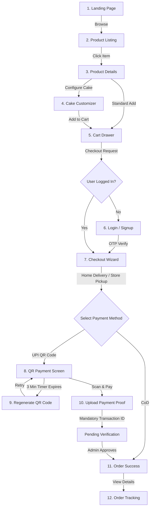
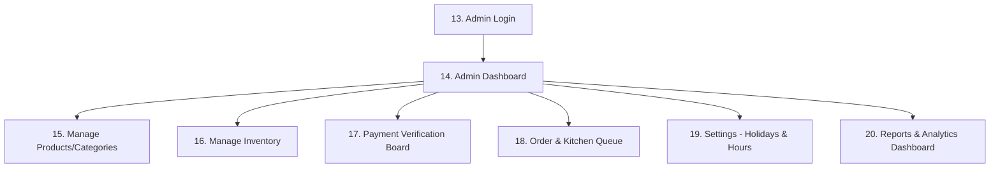

# Payal's Bakery Cottage - Screen Documentation & Navigation Flows

This document details the navigation structures, user journeys, screen lists, and individual screen specifications for the customers and admins of **Payal's Bakery Cottage**.

---

## 1. System Workflows & Navigation Diagrams

### 1.1 Customer Navigation & Checkout Flow
The customer journey transitions from initial discovery to custom configuration, cart checkouts, and payment verification.

### 1.2 Administrative Workflow
The backend panel features standard inventory controls, kitchen scheduling, and manual verification triggers.

---

## 2. Customer Screen Specifications

### 2.1 Landing Page
- **Purpose:** Brand landing, promotional hero showcase, and entry point to the catalog.
- **Key Components:** Header navigation banner, Hero section featuring interactive sliding banners of seasonal specials, Category cards (e.g., Cakes, Pastries, Cookies), "Customer Favorites" product grid, Testimonial cards, and Footer.
- **Interactive Elements/Buttons:** "Order Now" (Redirects to `/catalog`), "Customize a Cake" (Redirects directly to `/catalog?category=custom-cakes`), Category links.
- **Validation Rules:** N/A (informational).
- **Navigation:** Deep links to all categories; persistent cart button indicating item counts.
- **States:**
  - *Loading:* skeleton screens for the "Customer Favorites" section.
  - *Error:* static text warning if catalog fetch fails.
- **Responsive Behavior:** Hero layout shifts from horizontal side-by-side (desktop) to stacked vertical blocks (mobile). Category cards convert into a swipeable horizontal carousel on mobile.
- **Accessibility:** Carousel dots have descriptive `aria-label` properties ("Show slide 2 of 5"). Banner images include descriptive `alt` tags.

### 2.2 Login & Registration
- **Purpose:** User authentication and onboarding.
- **Key Components:** Vertical split layout. Forms for email/password, a social login fallback placeholder, and registration fields (Name, Phone, Email, Password).
- **Buttons:** "Sign In", "Create Account", "Forgot Password?".
- **Validation:**
  - Email: Standard RFC 5322 validation.
  - Password: Min 8 characters, 1 number, 1 uppercase, 1 special character.
  - Phone: Standard 10-digit format check.
- **Navigation:** Redirects to the checkout wizard if the login flow was triggered during checkout; otherwise, routes to the dashboard.
- **States:** Loading spinner overlay during credential verification.
- **Responsive Behavior:** 2-column desktop split collapses to single column center-aligned form on mobile.
- **Accessibility:** Native HTML5 form validation fields (`type="email"`, `autocomplete="username"`). Active screen-reader alerts for input errors (`aria-invalid="true"`, `aria-describedby="error-id"`).

### 2.3 OTP Verification & Password Reset
- **Purpose:** Confirming registration email and resetting lost passwords.
- **Key Components:** Centered card with 6-digit numeric input slot, countdown clock indicator, and password reset form (New Password, Confirm Password).
- **Buttons:** "Verify Code", "Resend OTP", "Submit New Password".
- **Validation:** OTP inputs allow numbers only, auto-focus moves to the next box upon entry.
- **Navigation:** OTP success transitions to login or dashboard.
- **States:** Resend button is disabled for 60 seconds (active countdown timer visible).
- **Responsive Behavior:** Optimized input spacing to prevent virtual keyboard overlaps on mobile browsers.
- **Accessibility:** OTP inputs use `inputmode="numeric"` to open numeric keypads automatically on mobile.

### 2.4 Product Listing & Details
- **Purpose:** Browse products, search, and access full details.
- **Key Components:**
  - *Listing:* Search bar, category filters, sidebar toggles (Dietary: Egg/Eggless, Sugar-free; Price Range slider; Sorting: Popularity, Price, Rating), product grid cards.
  - *Details:* Multi-image carousel, availability badges ("Available Today", "Pre-order"), dietary icons, product specs (shelf-life, allergens: nuts, dairy, gluten), review grid.
- **Buttons:** "Add to Cart", "Wishlist (Heart Icon)", "Write Review", "Close Detail Modal".
- **Validation:** Adding to cart checks item stock availability.
- **Empty State:** Illustrated card showing: "No products match your filters. Try clearing some filters." with a "Clear All Filters" button.
- **Loading State:** Shimmering skeleton cards replacing the product grid.
- **Responsive Behavior:** Filters sidebar is desktop-static; converts to a floating bottom drawer triggered by a "Filters" icon button on mobile. Grid dynamically switches columns: 4 (desktop) -> 3 (laptop) -> 2 (tablet) -> 1 (mobile).
- **Accessibility:** Color badges (e.g., red for "Out of Stock", green for "In Stock") are paired with descriptive text equivalents. Color alone is never used to convey status.

### 2.5 Cake Customizer Screen
- **Purpose:** Configure personalized cakes step-by-step with real-time price calculation.
- **Key Components:** Product image display showing flavor visual guides; custom options selectors (Flavors, Weight: 0.5kg to 5kg, Shape: Round/Square/Heart); Egg/Eggless toggle; text input for "Message on Cake" (character count limited); text input for design specifications; file upload dropzone for reference images; allergen acknowledgement checkbox.
- **Buttons:** "Upload Reference Photo" (max 3 images, 5MB each, triggers Cloudinary API), "Add Custom Cake to Cart".
- **Validation:**
  - Date selector: Blocks dates less than the configured lead time notice (e.g., 24/48 hours).
  - Allergen checkbox: Mandatory check before customizer allows adding the item to the cart.
  - Upload file: Hard verification for `.png, .jpg, .jpeg` extensions.
- **States:**
  - *Uploading:* progress bar overlaid on image thumbnails.
  - *Dynamic Price:* updates immediately on toggle changes (e.g., +₹100 for Eggless, scale pricing by weight).
- **Responsive Behavior:** Options form sits to the right of the image selector on desktop; stacks vertically on mobile with sticky bottom pricing summary.
- **Accessibility:** Inputs labeled with `aria-label` tags; upload zone triggers keyboard file explorer activation via Enter key.

### 2.6 Cart & Checkout Wizard
- **Purpose:** View order summary, enter delivery details, select occasion, calculate distance, and apply coupons.
- **Key Components:**
  - *Cart:* sliding side drawer listing item quantities, customization notes, subtotal, and a coupon entry field.
  - *Checkout Wizard:*
    - **Step 1 (Delivery Settings):** Option toggles: "Home Delivery" vs "Store Pickup". Address book dropdown with Google Maps autocomplete search. Occasion Selector (Birthday, Anniversary, etc.). Delivery Date Calendar and Time Window selector. Display recommendations to order at least 1 day in advance.
    - **Step 2 (Summary & Payment Selection):** Total checkout summary showing delivery charges (computed via distance slabs), item detail rows, and payment type selection (UPI QR Code vs Cash on Delivery).
- **Validation:**
  - Delivery Zone: Programmatic calculation locks addresses exceeding 15 km from the bakery.
  - Holiday Blockout: Calendar blocks dates flagged by the Admin.
  - Cash on Delivery Toggle: Disabled if globally turned off by Admin.
- **Empty State:** Cart drawer displays: "Your cart is empty. Let's add some treats!" with a "Start Shopping" button.
- **Responsive Behavior:** Stepper wizard displays horizontally on desktop, converts into a compact numbered progress circle (e.g., "Step 2 of 3") on mobile.
- **Accessibility:** Modals handle focus-locking; close buttons contain keyboard accessible `tabindex="0"`.

### 2.7 UPI Payment & Proof Upload
- **Purpose:** Display payment details, verify transaction, and submit payment evidence.
- **Key Components:** Dynamic QR Code card with unblurred UPI merchant address; countdown clock (starting at 3:00); screenshot file upload area; text field for the mandatory UPI Transaction ID (12-digit UTR).
- **Buttons:** "Upload Receipt", "Submit Payment & Order", "Regenerate QR Code".
- **Validation:**
  - UPI Transaction ID: Must be exactly 12 numeric digits. Screenshot file upload is mandatory.
  - Expiry: At 0:00, disables the upload form and displays an "Expired" watermark.
- **Navigation:** Valid submission routes to the Order Success screen.
- **Responsive Behavior:** QR Code and timer display side-by-side on desktop; stack vertically on mobile.
- **Accessibility:** Aria live region updates screen readers every 30 seconds with remaining payment time ("Payment session expires in 2 minutes").

### 2.8 Order Success & Tracking
- **Purpose:** Inform successful order receipt and monitor preparation milestones.
- **Key Components:** Confetti animation, Order ID display, PDF invoice download link, milestone progress stepper (`Pending Verification` -> `Order Accepted` -> `Preparing` -> `Out for Delivery` -> `Delivered`).
- **Milestone Details:** Shows the preparation state, the assigned delivery staff details, and the finalized delivery date/time confirmed by the Admin.
- **Buttons:** "Download PDF Invoice", "Continue Shopping", "Cancel Order" (active only if order is not accepted or delivery is $>24$ hours away).
- **Responsive Behavior:** Horizontal timeline layout wraps to vertical timeline on mobile viewports.
- **Accessibility:** High-contrast icons for each milestone stage; progress bar utilizes `role="progressbar"` with `aria-valuenow`.

---

## 3. Back-Office Admin Screen Specifications

### 3.1 Admin Login & Main Dashboard
- **Purpose:** Executive analytics monitoring and system gateways.
- **Key Components:**
  - Sidebar navigation links (Products, Orders, Payments, Inventory, Reports, Settings).
  - Metric summary cards (Today's Orders, Revenue, low stock count, pending verifications).
  - Graph cards (Hourly order density, monthly revenue bar charts).
  - "Recent Actions" table showing log changes.
- **Buttons:** "Filter Date Range", "Export CSV Dashboard", quick navigation tiles.
- **Responsive Behavior:** Admin sidebar collapses to a floating collapsible burger menu on smaller devices. Charts scale dynamically with container queries.

### 3.2 Product & Category Admin (CRUD)
- **Purpose:** Catalog inventory definition.
- **Key Components:** Paginated product database table; search/filter options; CRUD forms (Title, description, base pricing, category associations, preparation time selections, availability toggle).
- **Validation:** Inputs are sanitised. Images require validation to ensure they do not exceed 5MB.
- **Responsive Behavior:** Table columns hide selectively based on screen width (mobile view displays only thumbnail, title, and price, with a tap-to-expand details option).

### 3.3 Payment Verification Queue
- **Purpose:** Manual audit of client UPI screenshot and transaction IDs.
- **Key Components:** 2-column split board.
  - Left panel: list of orders pending verification.
  - Right panel: detailed side-by-side view showing the customer's uploaded receipt screenshot (supports click-to-zoom) and the customer-entered transaction ID, alongside the official Order ID and amount.
- **Buttons:** "Approve Payment" (triggers state shift to Payment Verified / Order Accepted transition), "Reject Payment" (opens a reason selector dialog box).
- **Validation:** Rejecting requires selecting or typing a reason (e.g., "Mismatched UTR", "Insufficient Amount").
- **Empty State:** Displays "All payments verified! Relax, your queue is clean."

### 3.4 Order & Kitchen Queue Board
- **Purpose:** Kitchen task prioritization and scheduling dispatcher.
- **Key Components:** Chronological list of orders grouped by preparation deadlines. Displays customizations (flavors, messages), reference thumbnails, event occasion (e.g., Wedding), and scheduling status.
- **Administrative Fields:** Input fields to set/edit the exact delivery time slot, select order priority, and assign to specific delivery staff.
- **Buttons:** "Accept & Schedule", "Start Preparing", "Dispatch for Delivery", "Mark Delivered".
- **Responsive Behavior:** Boards transition into touch-swipeable kanban columns on tablet screens.

### 3.5 Settings: Business Hours & Holidays
- **Purpose:** Set bakery opening hours and disable shop holiday calendar dates.
- **Key Components:**
  - Business hours form: day of the week selector, start/end time dropdowns, next-day processing time threshold (e.g., orders after 7:00 PM are flagged for next day).
  - Holiday configuration calendar: interactive year planner to select individual dates or ranges, closure type selector (Festival, Emergency, Maintenance), list of active holidays.
- **Validation:** Checks that start time precedes end time; prevents selecting past dates for holidays.
- **Buttons:** "Save Schedule", "Add Holiday Blockout", "Remove Blockout".
- **Responsive Behavior:** The configuration calendar scales smoothly to fit mobile views.

---

### End of Section 2: Complete Screen Documentation & Navigation Flows

"Section 2 (Complete Screen Documentation & Navigation Flows) is complete. 
Please review the user flows, screen lists, detailed layout definitions, validations, and responsive behaviors. Do you confirm these specifications and wish to proceed to Section 3 (Database Design)?"
